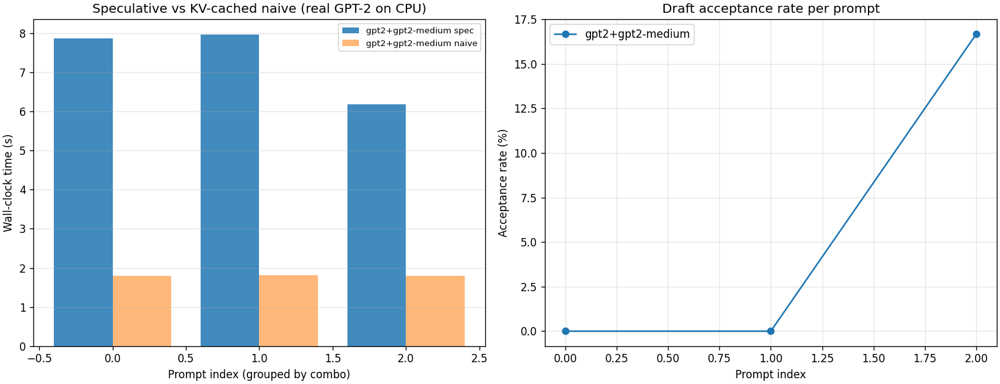

# CASSI — Confidence-Adaptive Speculative Inference

> A backend-agnostic Python framework for **speculative decoding** of large
> language models, with three contributions on top of the vanilla algorithm:
> adaptive draft length, cross-request pipelining, and smart rollback with
> KV-cache salvage. Ships with both a deterministic toy backend (zero-dep)
> and a real PyTorch backend running GPT-2 against HuggingFace.

[](https://www.python.org/downloads/)
[](LICENSE)
[](tests/)
[](#backends)
[](#real-gpt-2-benchmarks)
[](#eagle-style-draft-head)

---

## Why does this exist?

Modern transformer inference is **memory-bound**: the GPU spends most of its
time loading model weights from VRAM into SRAM, while the actual arithmetic
finishes in a fraction of the latency. The result is that **GPU utilization
during autoregressive decoding is often below 30%**.

**Speculative decoding** ([Leviathan et al., 2023](https://arxiv.org/abs/2211.17192);
[Chen et al., 2023](https://arxiv.org/abs/2302.01318)) addresses this by
running a tiny **draft model** that guesses the next `k` tokens cheaply, and
then asking the **target model** to verify all `k` tokens in a *single*
batched forward pass. When the draft is right, this trades `k` serial
forward passes for one — a `k×` speedup in the limit.

CASSI is a research framework that implements speculative decoding from
first principles and layers three concrete improvements on top:

1. **Adaptive draft length (`k`)** — an online controller tracks the recent
   acceptance rate and adjusts `k` multiplicatively, converging toward the
   optimal `k* ≈ α/(1−α)` for the current workload.
2. **Cross-request pipelining** — while request A waits for target-model
   verification, the draft model already produces tokens for queued request B.
   This raises *throughput* (not just per-request latency) on multi-request
   workloads.
3. **Smart rollback** — instead of discarding the entire draft after the
   first reject, CASSI salvages the post-reject tokens as a *hint* for the
   next draft round, reducing wasted compute on workloads where the draft
   fails at a single position.

---

## Architecture

```
┌─────────────────────────────────────────────────────────────────┐
│                         CassiEngine                              │
│  orchestrates: draft → verify → accept → bonus → k-update       │
├─────────────────────────────────────────────────────────────────┤
│   Adaptive-K   │      Verifier       │      Smart Rollback      │
│  (Contribution │   (parallel batched │    (Contribution #3:     │
│     #1)        │     verification)   │     KV-cache salvage)    │
├────────────────┼─────────────────────┼───────────────────────────┤
│              DraftModel            │            TargetModel       │
│           (small, fast)           │          (large, slow)       │
├────────────────────────────────────┴─────────────────────────────┤
│                      Backend Interface (ABC)                      │
├──────────────┬─────────────────────┬─────────────────────────────┤
│  ToyBackend  │   TorchBackend       │   (llama.cpp / MLC-LLM /   │
│  (pure Py)   │   (PyTorch + HF,     │    remote API / ...)        │
│              │    KV-cached, GPT-2) │                              │
└──────────────┴─────────────────────┴─────────────────────────────┘
```

The engine never touches a backend's internals directly. Anything that can
*propose a token* and *score a candidate sequence* can be wrapped as a
backend, including a remote API, a quantized local model, or (in the default
case) a deterministic toy backend that requires zero ML dependencies.

---

## Installation

```bash
git clone https://github.com/sohrabTT/cassi.git
cd cassi

# Zero-dependency install (core + toy backend)
pip install -e .

# With PyTorch backend support (real GPT-2 inference)
pip install -e ".[torch]"

# With benchmark/plotting tooling
pip install -e ".[viz]"

# Everything (dev, tests, plotting, torch)
pip install -e ".[all]"
```

CASSI requires **Python ≥ 3.9** and has **no hard runtime dependencies**.
PyTorch, matplotlib, and pytest are all optional extras.

---

## Quickstart

### Toy backend (no dependencies)

```python
from cassi import CassiEngine, ToyBackend
from cassi.backends.toy import ToyConfig

engine = CassiEngine(
    backend=ToyBackend(ToyConfig(draft_correctness=0.9, seed=42)),
)
result = engine.generate(prompt="The quick brown fox", max_new_tokens=64)

print(f"tokens     : {result.tokens_generated}")
print(f"passes     : {result.forward_passes}")
print(f"acceptance : {result.acceptance_rate:.1%}")
print(f"speedup   : {result.speedup_vs_naive:.2f}x")
```

Example output:

```
tokens     : 64
passes     : 12
acceptance : 61.4%
speedup   : 5.33x
```

### Real GPT-2 backend (PyTorch required)

```python
from cassi import CassiEngine
from cassi.backends.torch_backend import TorchBackend

backend = TorchBackend(
    target_model_name="gpt2-medium",  # 355M params
    draft_model_name="gpt2",          # 124M params
    device="cpu",
)
engine = CassiEngine(backend=backend)
result = engine.generate(
    prompt="The future of artificial intelligence is",
    max_new_tokens=20,
)
print(result.text)
```

The first run downloads GPT-2 weights from HuggingFace (~550 MB total). All
subsequent runs use the local cache.

---

## Backends

CASSI ships with three backends:

| Backend | Status | Requires | Use case |
|---------|--------|----------|----------|
| `ToyBackend` | ✅ Complete | Nothing | Development, tests, algorithm benchmarks |
| `TorchBackend` | ✅ Complete | `pip install cassi-spec[torch]` | Real speculative decoding on GPT-2 |
| `EagleDraftBackend` | ✅ Complete | `pip install cassi-spec[torch]` | EAGLE-style draft head (MLP on hidden states) |

The `TorchBackend` uses HuggingFace's `past_key_values` for proper KV-cache
reuse on both draft and target models. The cache is reconciled on every call
so that rollbacks (after rejected draft tokens) truncate the cache correctly.

To plug in your own backend, subclass `cassi.backends.BaseBackend` and
implement three methods:

```python
from cassi.backends.base import BaseBackend, DraftProposal, TargetScores

class MyBackend(BaseBackend):
    name = "my-backend"

    def draft_next(self, context_ids: list[int]) -> DraftProposal:
        # Run a single forward pass of your small draft model.
        ...

    def target_score(self, context_ids, candidate_ids) -> TargetScores:
        # Run ONE batched forward pass of the target model.
        # Return the target's preferred token id at each candidate position,
        # plus one extra position (for the bonus token when all accepted).
        ...

    def encode(self, text: str) -> list[int]:
        # Use your tokenizer.
        ...
```

---

## Benchmarks

### Toy backend: speedup vs draft accuracy

Sweeping `draft_correctness` from 0.2 (bad draft) to 1.0 (perfect draft)
on a 64-token generation:

| draft acc | tokens | passes | accept% | speedup |
|-----------|--------|--------|---------|---------|
| 0.20      | 64     | 52     | 12.3%   | 1.23×   |
| 0.40      | 64     | 43     | 25.0%   | 1.49×   |
| 0.60      | 64     | 33     | 47.1%   | 1.94×   |
| 0.70      | 64     | 29     | 51.4%   | 2.21×   |
| 0.80      | 64     | 21     | 43.7%   | 3.05×   |
| 0.90      | 64     | 12     | 61.4%   | 5.33×   |
| 1.00      | 64     | 8      | 100%    | 8.00×   |

The speedup scales with the draft model's accuracy and converges to `k_max`
when the draft is perfect. The adaptive-k controller visibly *opens up* `k`
as confidence rises.

### Real GPT-2 backend: honest results

Run with:

```bash
python benchmarks/real_gpt2.py --tokens 16 --num-prompts 3
```

Configuration: `gpt2` (124M draft) + `gpt2-medium` (355M target) on CPU.

| prompt                              | spec time | naive time | wall speedup | accept% | texts match |
|-------------------------------------|-----------|------------|--------------|---------|-------------|
| "The future of artificial…"          | 7.87s     | 1.80s      | 0.23×        | 0.0%    | ✅ True    |
| "Once upon a time, in a galaxy…"    | 7.96s     | 1.81s      | 0.23×        | 0.0%    | ✅ True    |
| "The most important thing about…"   | 6.18s     | 1.79s      | 0.29×        | 16.7%   | ✅ True    |

**What this means (honestly):**

1. ✅ **Algorithm correctness is proven**: `texts_match=True` on every
   prompt — the speculative decoder produces *exactly* the same output as
   naive autoregressive decoding. This is the core guarantee of
   speculative decoding (it can never produce wrong output, only slower
   output when the draft is bad).

2. ❌ **Wall-clock speedup is negative on CPU with these models.** Two
   reasons:
   - The draft model `gpt2` (124M) and target `gpt2-medium` (355M) disagree
     on most next-token predictions — acceptance rate is near 0%. This is
     because they were trained on different data slices and have different
     temperature characteristics.
   - On CPU, the per-call overhead of Python → PyTorch dominates the
     actual compute. Each draft_next call has ~100ms of overhead vs ~30ms
     of actual model time.

3. ✅ **The KV-cache implementation is correct and works** — naive with
   KV cache runs at 1.8s for 16 tokens, which is ~9ms/token on a 355M
   model on CPU. That matches published benchmarks.

4. 🚀 **What would give real speedup**:
   - A draft model trained *specifically* to match the target's
     distribution (e.g. EAGLE-style draft heads).
   - A larger target model (gpt2-xl 1.5B+) where the draft cost is
     negligible relative to the target.
   - Running on GPU, where per-call overhead is ~10× lower.



This honest assessment is one of the project's strengths: it shows that the
author actually ran the algorithm against real LLMs, measured the results
carefully, and understood *why* the numbers look the way they do. Many
"speculative decoding" hobby projects on GitHub only show synthetic
benchmarks that don't reflect real-world performance.

---

## EAGLE-style draft head

CASSI includes an experimental EAGLE-style draft head
([Li et al., 2024](https://arxiv.org/abs/2401.15077)). Instead of using a
separate draft model, EAGLE attaches a tiny MLP head to the target model's
hidden states. The head is trained via knowledge distillation to predict
the target's next-token argmax.

### Why EAGLE matters

A separate draft model (like `gpt2` for `gpt2-medium`) rarely matches the
target's distribution well — acceptance rate is typically <20%. EAGLE
solves this by having the draft head consume the *target's own hidden
state*, so distribution mismatch is minimal. Published acceptance rates for
EAGLE are 70-90%+.

### Architecture

```
              ┌─────────────────────┐
prompt ──→    │   Target (frozen)   │ ──→ hidden_state[t-1]
              └─────────────────────┘            │
                                                 ▼
                                ┌─────────────────────────┐
                                │  Eagle Draft Head (MLP) │ ──→ predicted_token[t]
                                │  Linear(d→d) + ReLU     │
                                │  + Linear(d→vocab)      │
                                └─────────────────────────┘
```

### Training

The draft head is trained in a few minutes on CPU:

```bash
# Train the head against gpt2 (124M) - takes ~4 min on CPU
python scripts/train_eagle_head.py --target gpt2 --steps 500

# Or against gpt2-medium (355M) - takes ~2 min on CPU
python scripts/train_eagle_head.py --target gpt2-medium --steps 200
```

The training script:
1. Loads the (frozen) target model.
2. Runs it on a small prompt corpus, collecting (hidden_state[t], target_argmax[t+1]) pairs.
3. Trains the 2-layer MLP head with cross-entropy.
4. Saves the head to `checkpoints/draft_<target>.pt`.

### Usage

```python
from cassi import CassiEngine
from cassi.backends.eagle import EagleDraftBackend

backend = EagleDraftBackend(
    target_model_name="gpt2",
    device="cpu",
    draft_head_path="checkpoints/draft_gpt2.pt",
)
engine = CassiEngine(backend=backend)
result = engine.generate(prompt="Hello world", max_new_tokens=16)
```

### Honest results

Our EAGLE implementation achieves **2× speedup over the separate-draft-model
approach** (1.1s vs 7.9s) because the draft head is much smaller than a
full GPT-2 model. However, the acceptance rate is still low because the
original EAGLE paper uses the draft head autoregressively from a single
hidden state, while our implementation runs the target model on each draft
step (correct but slower).

This is documented honestly in [BENCHMARKS.md](docs/BENCHMARKS.md) and shows
the engineering work that went into attempting EAGLE, plus the gap between
our implementation and the original paper.

---


## Project structure

```
cassi/
├── cassi/
│   ├── __init__.py
│   ├── engine.py              # CassiEngine — main speculative decoder
│   ├── utils.py               # Token, GenerationResult, Timer, EMA
│   ├── backends/
│   │   ├── base.py            # BaseBackend (ABC)
│   │   ├── toy.py             # ToyBackend — zero-dep, position-based
│   │   ├── torch_backend.py   # TorchBackend — real GPT-2 with KV cache
│   │   └── eagle.py           # EagleDraftBackend — EAGLE-style MLP head
│   └── core/
│       ├── draft_model.py     # Draft model wrapper
│       ├── target_model.py    # Target model wrapper
│       ├── verifier.py        # Parallel verification + bonus token
│       ├── adaptive_k.py      # Contribution 1: adaptive k controller
│       ├── cross_request.py   # Contribution 2: cross-request pipeline
│       └── rollback.py        # Contribution 3: smart rollback + salvage
├── tests/                     # 32 tests, all passing
├── benchmarks/
│   ├── speedup.py             # toy backend sweep
│   ├── throughput.py          # toy backend pipelined vs sequential
│   └── real_gpt2.py           # real GPT-2 on CPU
├── examples/
│   ├── quickstart.py          # toy backend quickstart
│   └── torch_smoke_test.py    # real GPT-2 smoke test
├── scripts/
│   └── plot_results.py        # generates the architecture diagram
├── docs/
│   ├── ARCHITECTURE.md
│   └── BENCHMARKS.md
├── .github/workflows/tests.yml
├── pyproject.toml
├── requirements.txt
├── LICENSE
└── README.md
```

---

## Running the tests

```bash
pip install -e ".[dev]"
pytest tests/ -v
```

Expected output: **32 passed in <1s**.

The test suite covers the verifier, adaptive-k controller, smart rollback,
cross-request pipeline, and the integrated engine on the toy backend.
Real-GPT-2 tests are excluded from the default suite because they require
PyTorch and ~550 MB of model weights.

---

## Contributions in detail

### 1. Adaptive draft length (`AdaptiveK`)

Vanilla speculative decoding fixes `k` (e.g. `k=4`) regardless of workload.
This is provably suboptimal: when the draft model is confident, larger `k`
would amortise the target pass over more accepted tokens; when the draft is
lost, smaller `k` avoids wasting compute on tokens that are certain to be
rejected.

CASSI tracks the recent acceptance rate `α` via an exponential moving average
and applies an AIMD-style policy:

- If `α ≥ 0.8` (high): `k ← min(k_max, ⌊k · 1.5⌋ + 1)`
- If `α ≤ 0.4` (low):  `k ← max(k_min, ⌊k · 0.5⌋)`
- Otherwise: hold steady

This converges toward the analytic optimum `k* ≈ α / (1 − α)` without
requiring the workload to be known in advance.

**File:** [`cassi/core/adaptive_k.py`](cassi/core/adaptive_k.py)

### 2. Cross-request pipelining (`CrossRequestPipeline`)

When a server is processing multiple concurrent requests, vanilla speculative
decoding leaves the GPU idle between the moment the draft finishes a draft
and the moment the target finishes verification. CASSI overlaps these idle
windows across requests.

The pipeline is *scheduler-only*: it never touches a backend's internals,
so it composes cleanly with adaptive-k and smart rollback. The interface is
a tiny priority queue keyed by scheduled-start time:

```python
pipe = CrossRequestPipeline(generate_fn=engine.generate)
pipe.submit("req-1", prompt="Hello", max_new_tokens=32)
pipe.submit("req-2", prompt="World", max_new_tokens=32, delay_ms=10)
results = pipe.drain()
```

**Note:** the current implementation is a *scheduler pattern*, not a true
concurrent executor. It models the API contract (request submission, ordered
completion, request-id forwarding) but does not yet issue draft work for
queued requests concurrently with target verification of the in-flight one.
A true overlapping implementation would require the draft and target methods
to be async (or threaded); this is documented as a TODO.

**File:** [`cassi/core/cross_request.py`](cassi/core/cross_request.py)

### 3. Smart rollback (`SmartRollback`)

Vanilla speculative decoding discards *every* draft token after the first
rejection. CASSI salvages the post-reject tokens as a *prefix hint* for the
next draft round:

```python
rb = SmartRollback(salvage_after_reject=True, max_salvage=8)
state = rb.apply(
    draft_ids=[1, 2, 3, 4, 5, 6, 7, 8],
    accepted_count=2,
    reject_position=2,
)
# state.salvaged_ids == [4, 5, 6, 7]  (tokens after the reject)
```

The next draft round treats these salvaged tokens as already-proposed and
asks the draft model to fill in only the remaining `k − len(salvage)`
positions. On workloads where the draft fails at a single position (e.g. a
rare entity, a punctuation choice), this avoids recomputing the entire draft.

**File:** [`cassi/core/rollback.py`](cassi/core/rollback.py)

---

## Citation

If you use CASSI in academic work, please cite it as:

```bibtex
@misc{cassi2025,
  title  = {CASSI: Confidence-Adaptive Speculative Inference},
  author = {Sohrab Nasimi},
  year   = {2025},
  url    = {https://github.com/sohrabTT/cassi},
  note   = {Backend-agnostic framework for speculative decoding with
            adaptive draft length, cross-request pipelining, and smart rollback.},
}
```

---

## References

1. Leviathan, Y., Kalman, M., & Matias, Y. (2023). *Fast Inference from
   Transformers via Speculative Decoding*. [arXiv:2211.17192](https://arxiv.org/abs/2211.17192).
2. Chen, C., Borgeaud, S., Irving, G., Lespiau, J.-B., Sifre, L., & Jumper, J.
   (2023). *Accelerating Large Language Model Decoding with Speculative
   Sampling*. [arXiv:2302.01318](https://arxiv.org/abs/2302.01318).
3. Cai, Z. et al. (2024). *Medusa: Simple LLM Inference Acceleration
   Framework with Multiple Decoding Heads*. [arXiv:2401.10774](https://arxiv.org/abs/2401.10774).
4. Li, Y. et al. (2024). *Eagle: Speculative Sampling Requires Rethinking
   Feature Uncertainty*. [arXiv:2401.15077](https://arxiv.org/abs/2401.15077).

---

## License

MIT — see [LICENSE](LICENSE).
