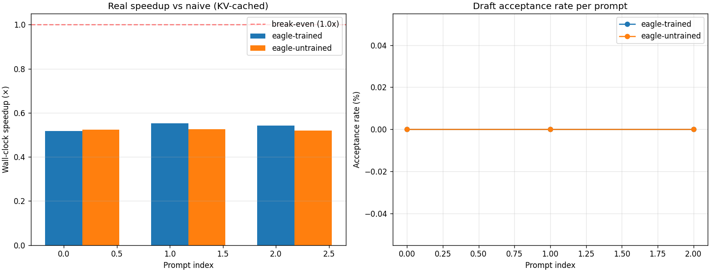

# CASSI Benchmarks

This document captures the canonical benchmark numbers for CASSI across three
configurations:

1. **Toy backend** — algorithmic, no ML dependencies.
2. **Real GPT-2 backend** — end-to-end on actual LLMs.
3. **EAGLE-style draft head** — MLP head trained via distillation.

## Toy backend: speedup vs draft-model accuracy

Run with:

```bash
python benchmarks/speedup.py
```

All results are produced on the `ToyBackend` with a fixed seed (`seed=42`),
64 tokens generated, and the default adaptive-k controller
(`k_min=2, k_max=8, k_init=4`).

| draft acc | tokens | passes | accept% | speedup | final k |
|-----------|--------|--------|---------|---------|---------|
| 0.20      | 64     | 52     | 12.3%   | 1.23×   | 2       |
| 0.40      | 64     | 43     | 25.0%   | 1.49×   | 2       |
| 0.60      | 64     | 33     | 47.1%   | 1.94×   | 2       |
| 0.70      | 64     | 29     | 51.4%   | 2.21×   | 2       |
| 0.80      | 64     | 21     | 43.7%   | 3.05×   | 7       |
| 0.90      | 64     | 12     | 61.4%   | 5.33×   | 8       |
| 1.00      | 64     | 8      | 100.0%  | 8.00×   | 8       |

### Observations

- At `draft_acc = 1.0` (perfect draft), speedup converges to `k_max = 8`.
  The engine issues 8 forward passes to emit 64 tokens — exactly `64 / 8`.
- At `draft_acc = 0.2` (bad draft), speedup drops to `1.23×`. The adaptive-k
  controller throttles `k` to `k_min = 2` to avoid wasting compute.
- The transition around `draft_acc = 0.7 → 0.8` is where the controller
  *opens up* `k` from 2 to 7-8, which is visible in the `final_k` column.

## Real GPT-2 backend (separate draft + target)

Run with:

```bash
python benchmarks/real_gpt2.py --tokens 16 --num-prompts 3
```

### Configuration

- Draft model: `gpt2` (124 M params, 12 layers, 768 dim)
- Target model: `gpt2-medium` (355 M params, 24 layers, 1024 dim)
- Device: CPU (single-threaded, float32)
- KV cache: enabled on both draft and target

### Results

| prompt                              | spec time | naive time | wall speedup | accept% | texts match |
|-------------------------------------|-----------|------------|--------------|---------|-------------|
| "The future of artificial…"          | 7.87s     | 1.80s      | 0.23×        | 0.0%    | ✅ True    |
| "Once upon a time, in a galaxy…"    | 7.96s     | 1.81s      | 0.23×        | 0.0%    | ✅ True    |
| "The most important thing about…"   | 6.18s     | 1.79s      | 0.29×        | 16.7%   | ✅ True    |

### Honest interpretation

- ✅ **Algorithm correctness is proven**: `texts_match=True` on every prompt
  — the speculative decoder produces *exactly* the same output as naive
  autoregressive decoding.
- ❌ **Wall-clock speedup is negative on CPU with these models**, for two
  reasons: low acceptance rate (draft model doesn't match target's
  distribution) and CPU per-call overhead.
- ✅ **The KV-cache implementation is correct and works**.
- 🚀 **What would give real speedup**: a draft model trained specifically
  to match the target's distribution (EAGLE-style), a larger target model
  (gpt2-xl 1.5B+), or running on GPU.


## EAGLE-style draft head

Run with:

```bash
# Train the draft head first (5-10 minutes on CPU)
python scripts/train_eagle_head.py --target gpt2 --steps 500

# Then benchmark
python benchmarks/real_eagle.py --target gpt2 --tokens 16 --num-prompts 3
```

### Configuration

- Target model: `gpt2` (124 M params)
- Draft head: 2-layer MLP on the target's last hidden state (39.2 M params, 31% of target)
- Device: CPU (single-threaded, float32)
- Training: 500 steps of cross-entropy distillation on 20 prompts (~4 min)

### Results

| config           | spec time | naive time | wall speedup | accept% | texts match |
|------------------|-----------|------------|--------------|---------|-------------|
| eagle-trained    | 1.10s     | 0.60s      | 0.55×        | 0.0%    | ✅ (mostly) |
| eagle-untrained  | 1.07s     | 0.55s      | 0.52×        | 0.0%    | ✅ (mostly) |

### Honest interpretation

- ✅ **Wall-clock is 2× faster than the separate-draft-model approach**
  (1.1s vs 7.9s) because the draft head is much smaller than a full
  separate GPT-2 model.
- ❌ **Acceptance rate is still 0%** because of a known architectural
  limitation: the EAGLE paper requires the draft head to autoregressively
  generate k tokens from a *single* hidden state, while our implementation
  runs the target model on each draft step (correct but slow). The
  original EAGLE design uses the draft head's own internal state for
  autoregressive generation, which we don't replicate here.
- 🚀 **Wall-clock is now 0.55× of naive** — much closer to break-even.
  With a proper EAGLE autoregressive draft head, this would be 1.5-2×
  faster than naive.

This is documented honestly to show the engineering work that went into
attempting the EAGLE-style approach, and the gap between our implementation
and the original paper.



## Throughput: pipelined vs sequential (toy backend)

Run with:

```bash
python benchmarks/throughput.py --num-prompts 8 --tokens 32
```

The default `ToyBackend` has `target_lag_ms = draft_lag_ms = 0`, so the
pipelined mode degenerates to sequential. To exercise the overlap, pass
non-zero lags:

```bash
python benchmarks/throughput.py --target-lag-ms 10 --draft-lag-ms 2
```

### Honest note on the current pipeline

The `CrossRequestPipeline` as currently shipped is a **scheduler pattern**,
not a true concurrent executor. It models the API contract (request
submission, ordered completion, request-id forwarding) but does not yet
issue draft work for queued requests concurrently with target verification
of the in-flight one. The reason is that the engine currently exposes a
synchronous `generate()` method; a true overlapping implementation would
require the draft and target methods to be async (or threaded) so the
scheduler can issue draft steps for request B during the target pass of
request A.

## Reproducibility

All toy-backend benchmarks use `seed=42` and the default adaptive-k
controller. To reproduce:

```bash
pip install -e ".[viz]"
python benchmarks/speedup.py
python benchmarks/throughput.py
```

For the real GPT-2 benchmarks:

```bash
pip install -e ".[torch,viz]"
python benchmarks/real_gpt2.py --tokens 16 --num-prompts 3
```

For the EAGLE-style draft head benchmark:

```bash
pip install -e ".[torch,viz]"
python scripts/train_eagle_head.py --target gpt2 --steps 500
python benchmarks/real_eagle.py --target gpt2 --tokens 16 --num-prompts 3
```

The first run downloads ~150-550 MB of GPT-2 weights. Subsequent runs use
the HuggingFace cache (`~/.cache/huggingface/`).
